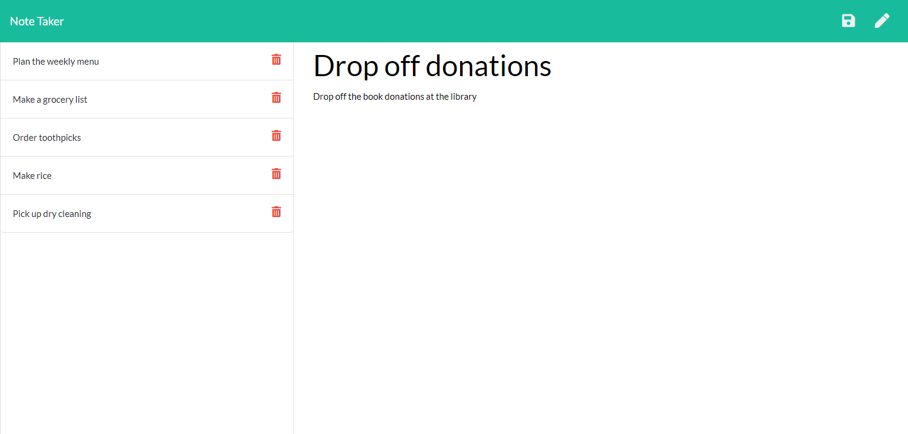

# Note Taker

## Application Description
This application provides a note taking application that stores data on a web server so the notes can be accessed from any device.  New notes can be added from any device, and details of each note can be viewed by clicking on the desired note from the side bar. Individual notes can be deleted and the data file on the server will be updated.

## Tools Used
* HTML
* CSS
* JavaScript ES5 and ES6
* Node.js
* Express.js
* AJAX
* Insomnia (https://insomnia.rest/)
* Heroku (https://dashboard.heroku.com/)
* npm shortid for unique id values for the notes

## Deployed Application
The application is deployed on Heroku at https://thawing-sands-67516.herokuapp.com/ 

Functionality can be tested, and new data will be retained for an indeterminate period of time. When Heroku restarts the dyno, any new data will be lost.

## Screenshot
